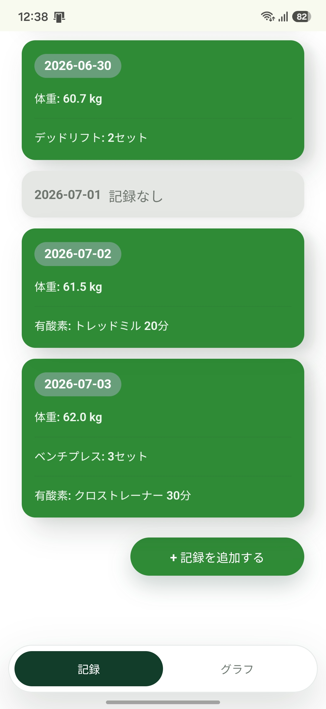
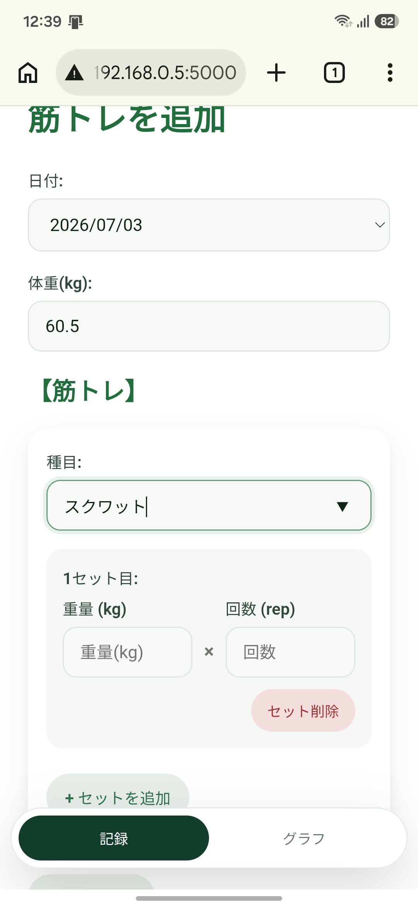
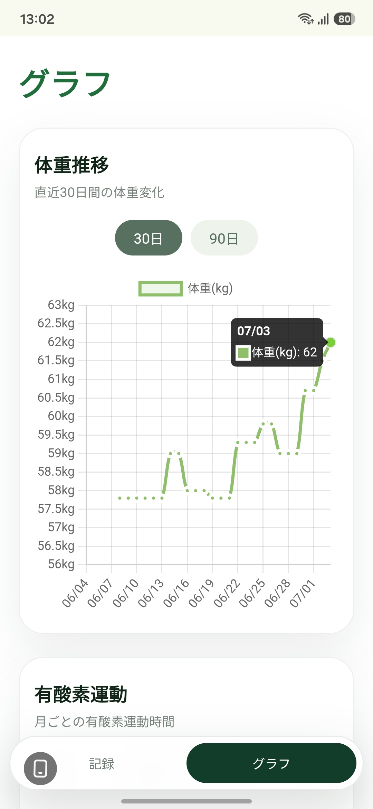

# Workout Log

## 公開URL

https://yamanosuku.pythonanywhere.com

## 公開デモについて

この公開版は、ポートフォリオ用の共有デモです。

ログイン機能は未実装のため、入力・編集・削除した内容は、すべての利用者に共有されます。個人情報や実際の健康情報は入力しないでください。

公開版には、機能やグラフ表示を確認するためのサンプルデータを登録しています。

## アプリ概要

このアプリは、日々の体重、筋力トレーニング、有酸素運動を記録し、日々の運動の成果を可視化できるWebアプリです。
私自身が日頃からジムでトレーニングをしており、記録をするようになってからトレーニングの成果を実感できるようになりました。その経験から、自分が求める方法で記録できないかと考え、アプリを開発しました。
操作性を重視し、短時間で記録できる仕様を意識しました。シンプルでありながら、日々の記録に必要な機能を備えています。


## 主な機能

- 体重の記録
- 筋力トレーニング（種目、重量、回数、セット）の記録
- 有酸素運動（マシン、分数）の記録
- 体重、有酸素運動の推移をグラフで可視化
- 過去の記録の編集、削除


## 使用技術

### Frontend
- HTML
- CSS
- JavaScript

### Backend
- Python
- Flask

### Database
- SQLite

### Development Environment
- VS Code
- Git
- GitHub

## 工夫した点

継続しやすくするため、操作性と分かりやすさを重視し、シンプルでモダンなデザインを採用しました。筋力トレーニングの記録では、セットを追加すると前のセットの重量と回数が引き継がれるようになっており、何度も同じ内容を入力する手間を減らしています。
また、体重のみを記録したい日でも入力できるようにし、実際の利用シーンを想定した設計としました。
さらに、体重や有酸素運動の推移を表示するグラフでは、表示期間を切り替えられるようにし、短期・長期の変化を確認しやすい仕様としました。

## セットアップ方法

### 1. リポジトリを取得する

```bash
git clone https://github.com/yamanosuku-sketch/workout-log.git
cd workout-log
```

### 2. 必要なライブラリをインストールする

```bash
python -m pip install -r requirements.txt
```

### 3. アプリを起動する

```bash
python app.py
```

### 4. ブラウザでアクセスする

```text
http://127.0.0.1:5000
```


## 開発を通して学んだこと

初めてのWebアプリ開発だったため、AIから実装方法の提案を受けながら、必要な機能や操作方法を考え、動作確認と修正を繰り返しました。
開発を通して、バックエンドとフロントエンドなど複数の技術が組み合わさってWebアプリが動いていることを学びました。また、提案された方法をそのまま使うのではなく、実際に使いやすいか確認しながら仕様を見直すことが大切だと感じました。 

## 今後の改善点

- 筋力トレーニングの重量・回数の推移をグラフで表示する機能
- ユーザーごとに記録を管理できるログイン機能
- 週ごとのトレーニング回数、推定1RM、自己ベストなどを自動集計する統計機能

## 画面イメージ

<table>
  <tr>
    <th>記録一覧画面</th>
    <th>記録追加画面</th>
    <th>グラフ画面</th>
  </tr>
  <tr>
    <td></td>
    <td></td>
    <td></td>
  </tr>
</table>
